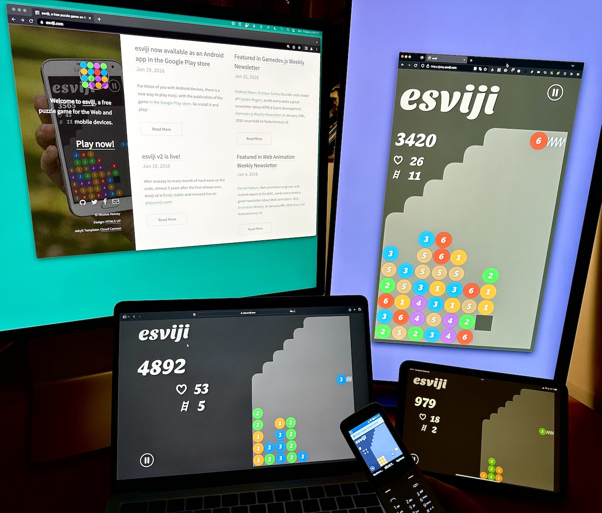
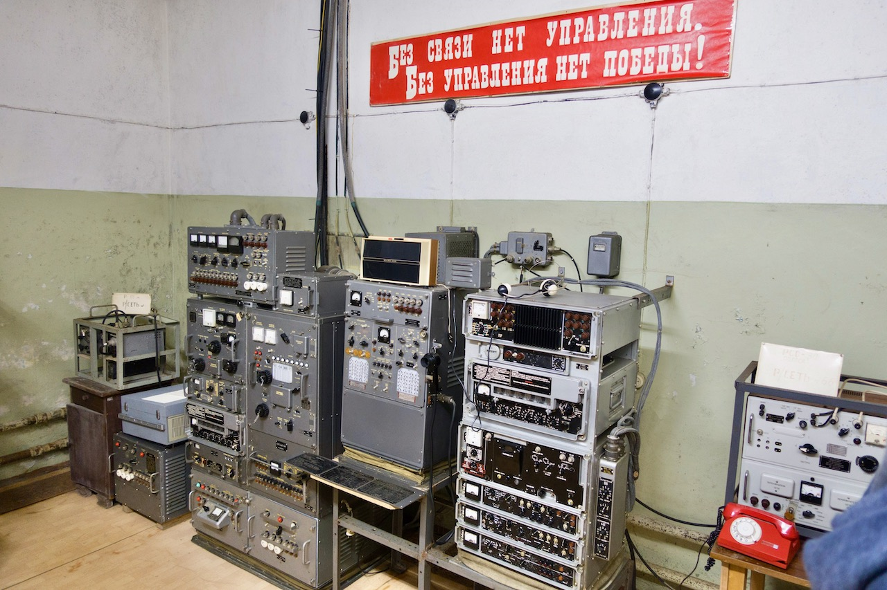
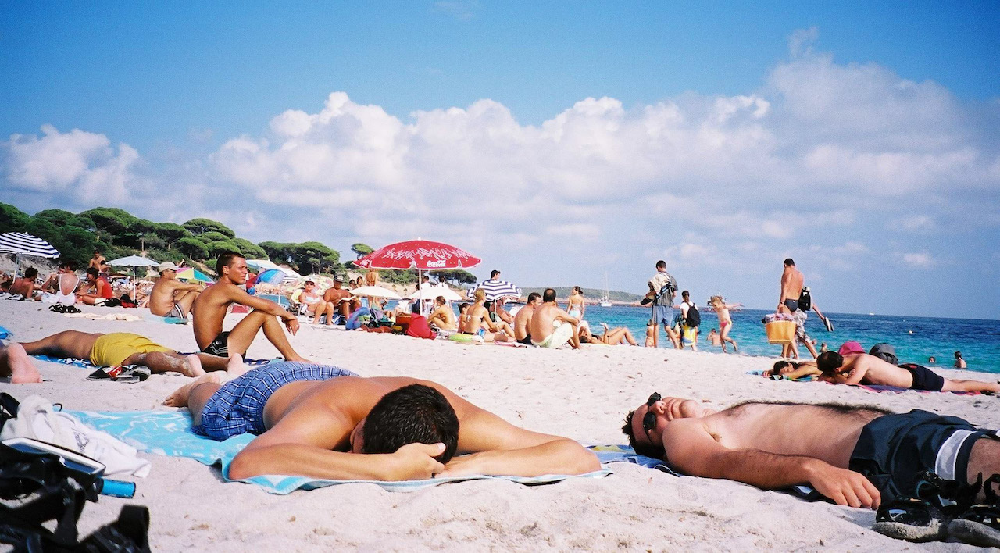
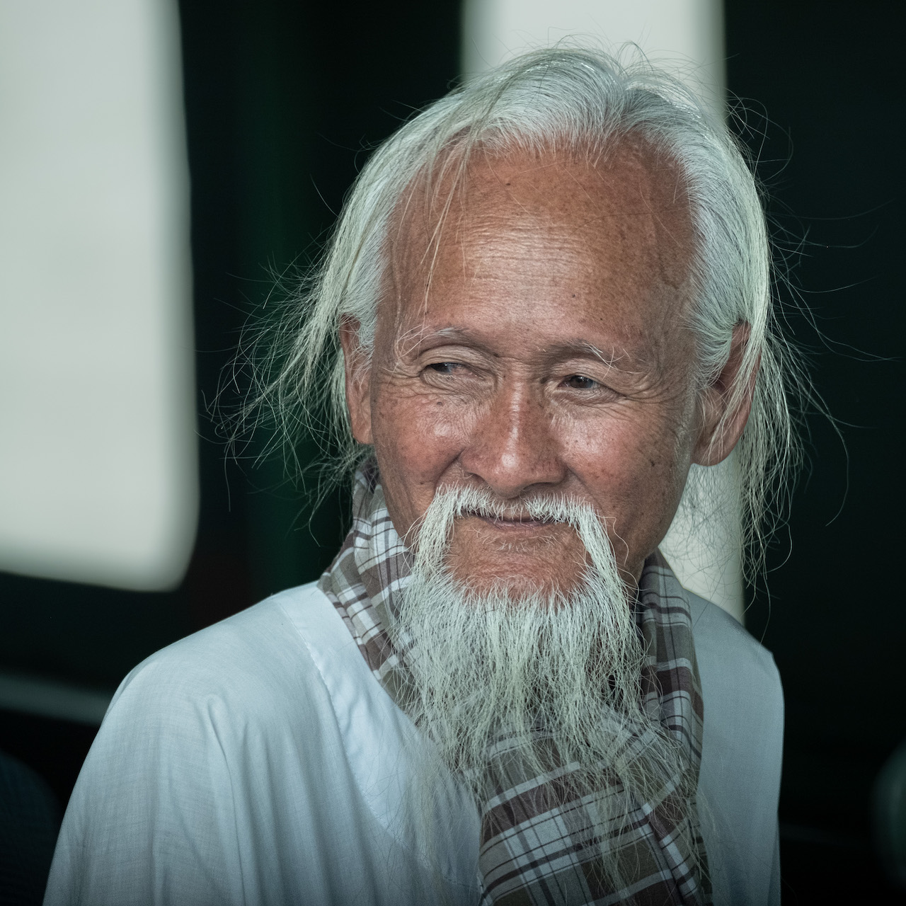
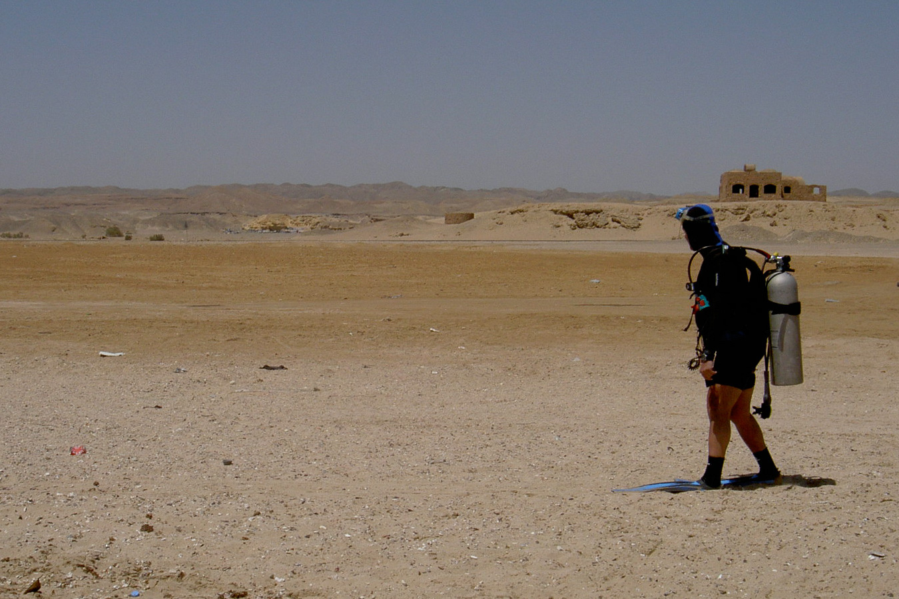
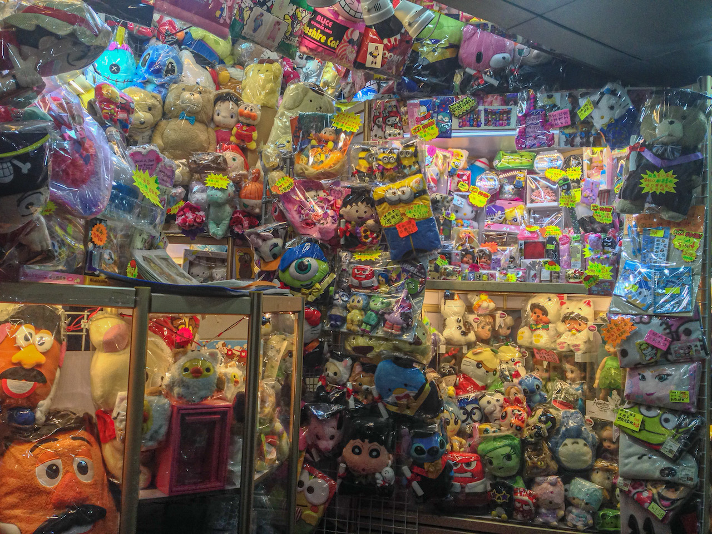
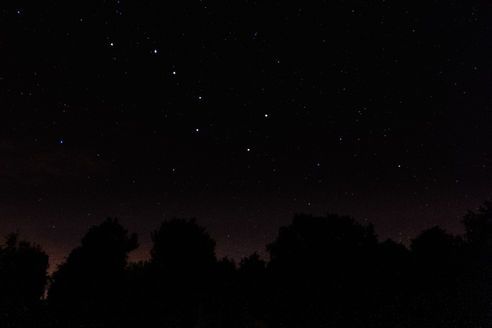
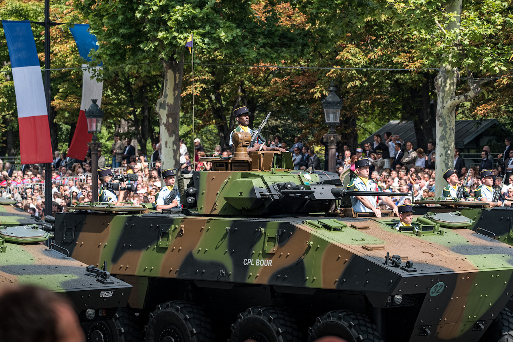

French photographer [Yann Chemineau](http://gallery.chemineau.eu/) organized a [monthly photo challenge on Mastodon](https://piaille.fr/@yanncphoto/109517110699846391). With 2 themes every day, you had to post one photo for each theme, or one single photo for both themes, with hashtag `#PhotoJanuary2023`.

Here's the list of themes, the photos I posted and comments (in French) I made for some:

<table>
  <thead>
    <tr>
      <th>January</th>
      <th>Theme 1</th>
      <th>Theme 2</th>
    </tr>
  </thead>
  <tbody>
    <tr>
      <th rowspan="2">1st</th>
      <th>“a 23 but not a calendar”</th>
      <th>“funny”</th>
    </tr>
    <tr>
      <td class="nope">🚫</td>
      <td></td>
    </tr>
    <tr>
      <th rowspan="2">2nd</th>
      <th colspan="2">“weird” & “shot abroad”</th>
    </tr>
    <tr>
      <td colspan="2"></td>
    </tr>
    <tr>
      <th rowspan="2">3rd</th>
      <th colspan="2">a landscape & “shot at night”</th>
    </tr>
    <tr>
      <td colspan="2"></td>
    </tr>
    <tr>
      <th rowspan="2">4th</th>
      <th>“failed”</th>
      <th>“mostly yellow”</th>
    </tr>
    <tr>
      <td class="nope">🚫</td>
      <td></td>
    </tr>
    <tr>
      <th rowspan="2">5th</th>
      <th>“music”</th>
      <th>“an animal”</th>
    </tr>
    <tr>
      <td></td>
      <td>
        
        <blockquote lang="fr">
          
(Le « de » m'a fait hésiter sur la photo potentielle…)

        </blockquote>
      </td>
    </tr>
    <tr>
      <th rowspan="2">6th</th>
      <th>“greedy”</th>
      <th>“shot today”</th>
    </tr>
    <tr>
      <td>
        
        <blockquote lang="fr">
          
(J'adore les dragibus ! 🤤)

        </blockquote>
        </td>
      <td class="nope">🚫</td>
    </tr>
    <tr>
      <th rowspan="2">7th</th>
      <th>“in low-angle”</th>
      <th>“a tree”</th>
    </tr>
    <tr>
      <td></td>
      <td>
        
        <blockquote lang="fr">
Petit souvenir d'une plage de rêve dans la péninsule de Samaná en République dominicaine.
</blockquote>
        </td>
    </tr>
    <tr>
      <th rowspan="2">8th</th>
      <th>“snowy”</th>
      <th>“a bridge”</th>
    </tr>
    <tr>
      <td></td>
      <td></td>
    </tr>
    <tr>
      <th rowspan="2">9th</th>
      <th>“romantic”</th>
      <th>“nobody”</th>
    </tr>
    <tr>
      <td>
        
        <blockquote lang="fr">
La célèbre photo d'Alfred Eisenstaedt (controversée) revue et colorée par Eduardo Kobra sur un mur de Manhattan.

Ce mur a malheureusement été effacé depuis…
</blockquote>
      </td>
      <td>
        
        <blockquote lang="fr">
Plage de sable blanc et mer turquoise, mais personne ? 🤔

Il faut dire que l'eau est encore fraîche, le premier mai… en Écosse ! 😅
</blockquote>
      </td>
    </tr>
    <tr>
      <th rowspan="2">10th</th>
      <th>“in the street”</th>
      <th>“in the rain”</th>
    </tr>
    <tr>
      <td>
        
        <blockquote lang="fr">
C'est bon, c‘est valide comme « rue » ? 😅
</blockquote>
      </td>
      <td>
        
        <blockquote lang="fr">
Ma première séance photo avec ma grande fille, il y a déjà 4 ans ! 🤩
</blockquote>
      </td>
    </tr>
    <tr>
      <th rowspan="2">11th</th>
      <th>“a door”</th>
      <th>“with constrast”</th>
    </tr>
    <tr>
      <td>
        
        <blockquote lang="fr">
Cette porte était l'entrée du parc national du Lac Nakuru, dans la vallée du Rift au Kenya.

Le niveau des eaux a toujours fluctué au fil de l'année, mais le niveau moyen monte maintenant inexorablement d'année en année à cause du réchauffement climatique, et menace un écosystème naturel riche, ainsi que les populations locales.
</blockquote>
      </td>
      <td>
        
        <blockquote lang="fr">
Encore une session portrait grâce à Thanh et Pierre ! 🙏
</blockquote>
        </td>
    </tr>
    <tr>
      <th rowspan="2">12th</th>
      <th>“a boat”</th>
      <th>“shot from above”</th>
    </tr>
    <tr>
      <td>
        
        <blockquote lang="fr">
Le Day Star (晨星號) visible ici a été construit en 1964 et transporte plusieurs fois par jour plus de 500 personnes d'un côté à l'autre de Victoria Harbour, entre l'île de Hong Kong et Kowloon.

Quand on a un peu de temps, c'est tellement plus plaisant que prendre le métro !
</blockquote>
        </td>
      <td>
        
        <blockquote lang="fr">
La vue sur Hong Kong depuis le pic Victoria est incroyable de jour comme de nuit.

Le soir, l'animation Symphony of Lights — plutôt prévue pour être vue depuis l'autre côté de la baie — sublime quand même la ville avec des effets colorés et des faisceaux de lumière.
</blockquote>
      </td>
    </tr>
    <tr>
      <th rowspan="2">13th</th>
      <th>“a videogame”</th>
      <th>“in the dark”</th>
    </tr>
    <tr>
      <td>
        <figure class="frame"></figure>
        <blockquote lang="fr">
          
🧩 L'occasion de présenter le jeu de puzzle que j'ai inventé il y a… déjà 30 ans ! 😱

          
🕹️ https://play.esviji.com

          
🧮 Inventé en 1992 pour mes calculettes HP 48 (en RPL 😅).

          
🕸️ Puis décliné pour le Web depuis 10 ans. Grâce au responsive et SVG, il tourne sur toutes les tailles et orientations d'écrans, cf photo.

          
Dopé en PWA, il est installable partout. Si vous préférez les stores, il est sur Google Play et Windows Store.

Have fun!

        </blockquote>
      </td>
      <td>
        
        <blockquote lang="fr">
Un bar/restaurant sur la plage de Trouville, seule présence dans la nuit très noire, sans étoiles…
</blockquote>
      </td>
    </tr>
    <tr>
      <th rowspan="2">14th</th>
      <th>“a closeup”</th>
      <th>“computer related (but not a keyboard)”</th>
    </tr>
    <tr>
      <td>
        
        <blockquote lang="fr">
C'est assez près ? 😅

Je n'ai « malheureusement » jamais réussi à avoir en macro la variante tigre, pourtant en forte présence chez moi, ils sont intenables en shooting photo…
</blockquote>
      </td>
      <td>
        <figure class="frame"></figure>
        <blockquote lang="fr">
Un ensemble de systèmes électroniques (Peut-on vraiment dire informatique ?) dans un bunker très profond sous terre, quelque part en Lettonie.
</blockquote>
      </td>
    </tr>
    <tr>
      <th rowspan="2">15th</th>
      <th>“lazy”</th>
      <th>“black & white”</th>
    </tr>
    <tr>
      <td>
        <figure class="frame"></figure>
        <blockquote lang="fr">
Je n'aime pas trop lézarder au soleil sur la plage, mais après 15 jours de randonnée plutôt difficile sur le GR20, la sieste récupératrice sur la plage corse était cette fois là bien agréable !
</blockquote>
      </td>
      <td>
        
        <blockquote lang="fr">
Un portrait de plus pris lors d'un workshop portrait animé par Flou Sentimental / Thanh. 😍
</blockquote>
      </td>
    </tr>
    <tr>
      <th rowspan="2">16th</th>
      <th>“stairs”</th>
      <th>“elderly person”</th>
    </tr>
    <tr>
      <td>
        
        <blockquote lang="fr">
L'escalier Bramante est situé dans les musées du Vatican. Attribué à tort à Donato Bramante, cet escalier a été conçu par Giuseppe Momo en 1932, inspiré par un escalier plus ancien conçu en réalité par Bramante.

Cet escalier est une double hélice, c'est-à-dire qu'il comporte deux escaliers, l'un pour monter, l'autre pour descendre. Ainsi, aucun ne se croise dans le sens inverse.
</blockquote>
        </td>
      <td>
        <figure class="frame"></figure>
        <blockquote lang="fr">
Nous avons été subjugués par le charisme de cet homme, croisé sur un ferry en traversant un bras du Mekong, au Vietnam.
</blockquote>
      </td>
    </tr>
    <tr>
      <th rowspan="2">17th</th>
      <th>“winter”</th>
      <th>“mostly blue”</th>
    </tr>
    <tr>
      <td>
        
        <blockquote lang="fr">
Ce n'est pas tous les jours que l'on voit la mer geler. Ici, c'était en Suède, un peu au nord de Stockholm.
</blockquote>
      </td>
      <td>
        
        <blockquote lang="fr">
Je n'ai pas la meilleure expérience qui soit avec les méduses en eau vive (oui, ça fait très mal), mais je les trouve très captivantes quand une vitre nous sépare… 😅
</blockquote>
      </td>
    </tr>
    <tr>
      <th rowspan="2">18th</th>
      <th>“dancing”</th>
      <th>“in the sand”</th>
    </tr>
    <tr>
      <td>
        
        <blockquote lang="fr">
Souvenir d'une nuit endiablée au Space, le fameux club de Ibiza (disparu il y a quelques années), avec notamment un set incroyable du duo DubVision.
</blockquote>
      </td>
      <td>
        <figure class="frame"></figure>
        <blockquote lang="fr">
Les grenouilles ne sont pas trop à l'aise dans le désert en général, on se demande ce que celle-ci fait là…
</blockquote>
      </td>
    </tr>
    <tr>
      <th rowspan="2">19th</th>
      <th>“a couple”</th>
      <th>“architectural”</th>
    </tr>
    <tr>
      <td>
        
        <blockquote lang="fr">
Ne sont-ils pas mignons, ces deux calao à joues argentées ? On les trouve essentiellement sur la côte est de l'Afrique, ici dans le coin de Diani Beach au Kenya.
</blockquote>
        </td>
      <td>
      <blockquote lang="fr">
Les parisien·ne·s reconnaîtront sans doute Beaubourg, plus officiellement nommé « centre national d’art et de culture Georges-Pompidou ».
</blockquote>
      </td>
    </tr>
    <tr>
      <th rowspan="2">20th</th>
      <th>“a plush toy”</th>
      <th>“an occupation”</th>
    </tr>
    <tr>
      <td>
        <figure class="frame"></figure>
        <blockquote lang="fr">
          
Ok, bien plus qu'une…

          
Le centre commercial Sino Center à Hong Kong est un amalgame aux couleurs vives de la culture pop, avec sur quatre étages une multitude de toutes petites boutiques remplies de mangas, figurines, jouets, peluches, etc. du sol au plafond. C’est un endroit parfait pour les amateurs d’anime en tous genres.

        </blockquote>
      </td>
      <td>
        
        <blockquote lang="fr">
Ce forgeron n'est malheureusement pas un « vrai » artisan en exercice, je l'ai photographié dans l'étonnant Openluchtmuseum (musée en plein air) près d'Arnhem, aux Pays-Bas, où il est possible de découvrir les différentes régions et coutumes, et l'histoire des Pays-Bas, avec des reconstitutions.
</blockquote>
      </td>
    </tr>
    <tr>
      <th rowspan="2">21st</th>
      <th>“electrical”</th>
      <th>“shot at work/occupation”</th>
    </tr>
    <tr>
      <td>
        
        <blockquote lang="fr">
Électricité se dit « Electricidade » en portugais, langue que je connais bien trop peu pour savoir si le terme « Elétricos » qui désigne les tramways a une même origine. En tout cas, ils sont électriques !
</blockquote>
      </td>
      <td class="nope">🚫</td>
    </tr>
    <tr>
      <th rowspan="2">22nd</th>
      <th>“partially blurry”</th>
      <th>“official”</th>
    </tr>
    <tr>
      <td>
        
        <blockquote lang="fr">
          
J'aime beaucoup ces photos prises à la limite de la surface de l'eau.

Là je plongeais avec un petit appareil jetable en plastique, alors forcément c'est pas super net… 😅

          
Vous pouvez retrouver quelques centaines de photos de ce type dans un groupe que j'ai créé sur Flickr il y a quelques années : <a href="https://www.flickr.com/groups/halfway_air_water/">Split level photography: camera halfway between air and water</a>

        </blockquote>
      </td>
      <td>
        <figure class="frame"></figure>
        <blockquote lang="fr">
          
<strong>Donald Trump vs Daft Punk</strong>

          
Je ne suis pas fan des défilés militaires (euphémisme), mais quand on m'a invité à une place sur les Champs Élysées proche de la Place de la Concorde, je me suis dit que ça pourrait être intéressant photographiquement.

          
Le meilleur souvenir reste ce medley de Daft Punk joué par la fanfare, j'adore la gueule enfarinée de Donald Trump (d'un peu loin quand même).

          
À revoir grâce à l'INA : <a href="https://www.ina.fr/ina-eclaire-actu/daft-punk-au-programme-du-defile-du-14-juillet-2017">Daft Punk au programme du défilé... du 14 juillet 2017</a>

        </blockquote>
      </td>
    </tr>
    <tr>
      <th rowspan="2">23rd</th>
      <th>“shot more than 2 years ago”</th>
      <th>“astronomical”</th>
    </tr>
    <tr>
      <td>
        
        <blockquote lang="fr">Une photo prise il y a déjà 18 ans, avec mon premier appareil photo numérique, un compact Konica. Pas mécontent du résultat à main levée et 1/8 s !
</blockquote>
        </td>
      <td>
        <figure class="frame"></figure>
        <blockquote lang="fr">
          
<strong>Ursa Major</strong>

          
J'ai déjà fait quelques tentatives d'astro-photographie, mais ça n'a jamais été vraiment probant, il faudrait que je m'y mettre plus sérieusement.

          
Il se peut que sur celle-ci j'ai triché un peu sur la luminosité apparente de quelques étoiles… 😅

        </blockquote>
      </td>
    </tr>
    <tr>
      <th rowspan="2">24th</th>
      <th>“ice”</th>
      <th>“sunny”</th>
    </tr>
    <tr>
      <td>
        
        <blockquote lang="fr">
          
Je vous présente la mer de glace.

          
Non non, pas celle près de Chamonix dans les Alpes, qui est en train de disparaître. 🥺

          
C'est ici la mer Baltique, et plus précisément une berge de la baie de Trälhavet, au nord de Stockholm.

        </blockquote>
      </td>
      <td>
        
        <blockquote lang="fr">
          
La magie des rayons du soleil qui percent à travers le feuillage, ici dans l'Espace Rambouillet, un merveilleux parc de près de 200 hectares où circulent en liberté sangliers, cervidés et autres animaux des bois.

          
Malheureusement fermé depuis trop longtemps, il devrait rouvrir ce printemps : <a href="https://www.espacerambouillet.fr/2023-un-nouveau-projet-pour-le-developpement-de-lespace-rambouillet">Un nouvel opérateur pour l'Espace Rambouillet</a>

        </blockquote>
      </td>
    </tr>
    <tr>
      <th rowspan="2">25th</th>
      <th>“rhymes with January”</th>
      <th>“a reflection”</th>
    </tr>
    <tr>
      <td>
        
        <blockquote lang="fr">
Ok, c'est un peu bancal, je poste pour une fois sur le thème en anglais “rhymes with January”… 😅
</blockquote>
      </td>
      <td>
        
        <blockquote lang="fr">
Une nouvelle photo de l'étonnant Openluchtmuseum (musée en plein air) près d'Arnhem, aux Pays-Bas, d'où venait aussi le forgeron du 20 janvier.
</blockquote>
      </td>
    </tr>
    <tr>
      <th rowspan="2">26th</th>
      <th colspan="2">“food” & “manuscript”</th>
    </tr>
    <tr>
      <td>
        <figure class="frame portrait"></figure>
      </td>
      <td>
        <blockquote lang="fr">
          
Pour une fois, une photo que je n'ai pas réalisée seul.

          
Fruit du travail en groupe avec deux comparses de mon club photo de Draveil, dans le cadre d'ateliers d'apprentissage de la photo culinaire : <a href="https://www.photo-club-draveil.fr/">photo-club-draveil.fr</a>

        </blockquote>
      </td>
    </tr>
    <tr>
      <th rowspan="2">27th</th>
      <th>“in motion”</th>
      <th>“childish”</th>
    </tr>
    <tr>
      <td>
        
        <blockquote lang="fr">
Un gros avantage de la photographie en studio est le contrôle total de la lumière, par exemple ici avec un stroboscope.
</blockquote>
      </td>
      <td>
        
        <blockquote lang="fr">
          
Les enfants aiment jouer, et il leur faut peu de chose comme accessoire.

          
Ici, nous leur offrons mille cadeaux sophistiqués et coûteux, et ils préfèrent parfois jouer avec les cartons d'emballage…

          
Là-bas, au Kenya par exemple, ils n'ont pas la « chance » d'avoir tant de gadgets, ils font avec les moyens du bord, et s'amusent comme des fous !

        </blockquote>
      </td>
    </tr>
    <tr>
      <th rowspan="2">28th</th>
      <th>“a green vehicle”</th>
      <th>“a bench”</th>
    </tr>
    <tr>
      <td>
        <figure class="frame"></figure>
        <blockquote lang="fr">
Je ne suis vraiment pas d'un naturel belliqueux, mais ça me ferait bien plaisir qu'on envoi en Ukraine un max de ces véhicules verts qu'on voit défiler sur les Champs Élysées le 14 juillet, pour botter le cul définitivement à Poutine !
</blockquote>
      </td>
      <td>
        
        <blockquote lang="fr">
          
C'est vrai que le château de Blair, dans le Perthshire en Écosse, est plutôt joli, et atypique.

          
Mais de là à s'assoir sur un banc juste devant ? 🤔

        </blockquote>
      </td>
    </tr>
    <tr>
      <th rowspan="2">29th</th>
      <th>“your favourite beverage”</th>
      <th>“shot less than 1 hour ago”</th>
    </tr>
    <tr>
      <td>
        
        <blockquote lang="fr">
Entre la bière et le vin, mon cœur balance. Les deux ne sont pas associés aux mêmes moments, il n'y a pas vraiment de compétition.
</blockquote>
      </td>
      <td class="nope">🚫</td>
    </tr>
    <tr>
      <th rowspan="2">30th</th>
      <th>“a road”</th>
      <th>“to scale...”</th>
    </tr>
    <tr>
      <td>
        
        <blockquote lang="fr">
          
Lors d'un séjour au Kenya il y a quelques années, nous avons passé de nombreuses heures sur des pistes de terre comme celle-ci.

          
Tout en donnant au voyage une ambiance d'aventure au début, il est rapidement devenu très fatiguant d'être secoué pendant des heures presque tous les jours.

          
Mais cela en valait la peine, c'était le seul moyen d'aller dans des endroits inoubliables.

        </blockquote>
      </td>
      <td>
        
        <blockquote lang="fr">
          
Le volcan est entré en éruption et les volcanologues observent les émissions de lave pour déterminer l'impact sur les populations environnantes.

          
En résonance avec <a href="https://arstechnica.com/gaming/2023/01/love-among-the-volcanoes-fire-of-love-remembers-maurice-and-katia-krafft/">l'actu partagée par Ars Technica</a> : « Les volcanologues Maurice et Katia Krafft ont osé aller là où la plupart de leurs collègues craignaient de s'aventurer : au bord d'un volcan en éruption. » 

        </blockquote>
      </td>
    </tr>
    <tr>
      <th rowspan="2">31st</th>
      <th>“with a scent”</th>
      <th>“in black & white”</th>
    </tr>
    <tr>
      <td>
        
        <blockquote lang="fr">
          
J'ai photographié ces spirales d'encens dans le temple Man Mo à Sheung Wan, sur l'île de Hong Kong.

          
Les photographes sont explicitement autorisés dans cette partie du temple tant qu'ils ne dérangent pas les pratiquants.

        </blockquote>
      </td>
      <td>
        
        <blockquote lang="fr">
          
Voici Reitdiephaven, à Groningen, dans le nord des Pays-Bas.

          
Ces maisons sont célèbres pour leurs couleurs accrocheuses, je devais essayer une autre vision.

        </blockquote>
      </td>
    </tr>
    <tr>
      <th rowspan="2">Bonus</th>
      <th colspan="2">A photo with at least 3 themes above to choose from</th>
    </tr>
    <tr>
      <td colspan="2">
        
        <blockquote lang="fr">
          
Je tente en 5 thèmes avec « amusante », « bizarre », « de près », « partiellement floue » et « à l’échelle… » ! 💪

          
J'hésite à compter « gourmande » et « culinaire » pour que ça fasse 7 thèmes… 🤢😅

          
Un étrange astéroïde s'est écrasé… les enquêteurs scientifiques tentent de comprendre sa composition et les risques sanitaires potentiels pour la population !

        </blockquote>
      </td>
    </tr>
  </tbody>
</table>

It was a really fun experience, thanks a lot Yann!
