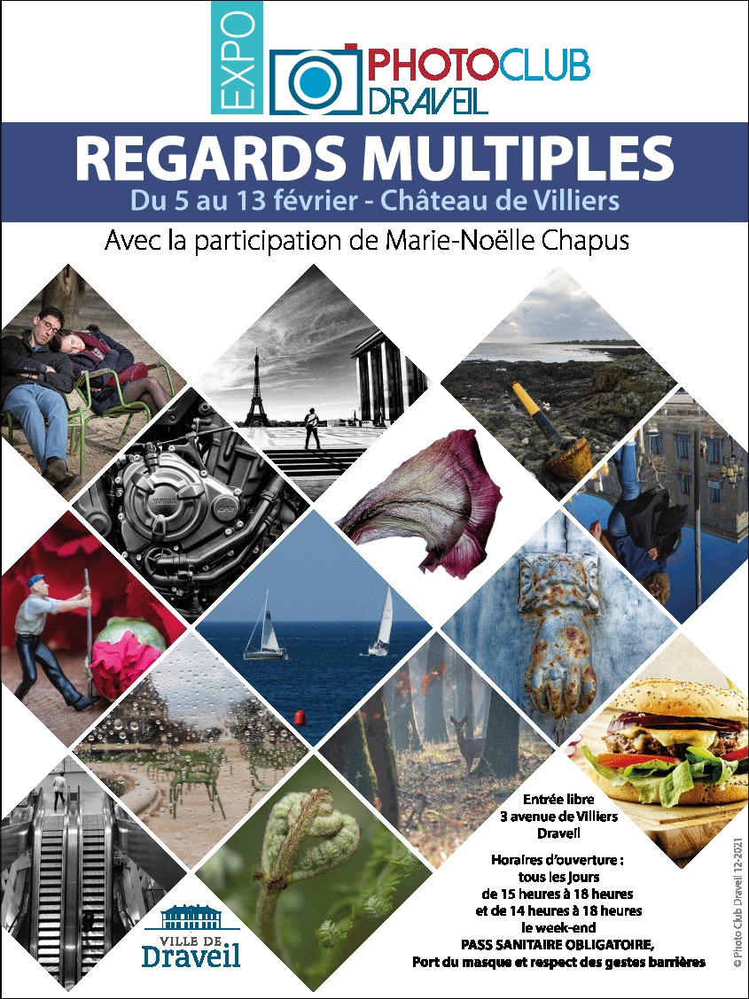
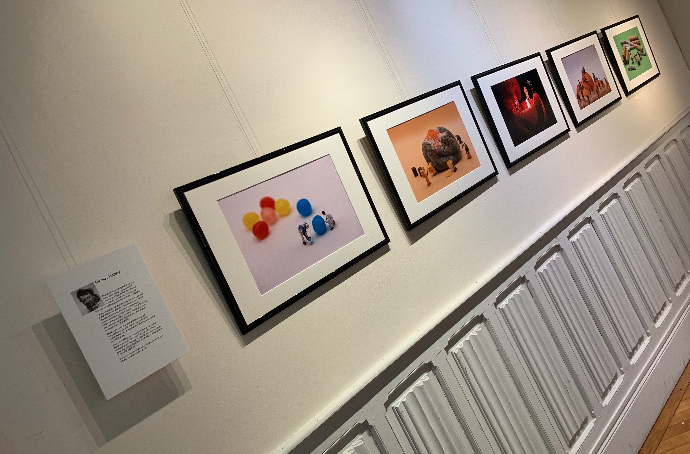

{.logo}
From February 5th to 13th, a dozen fellow photographers from the [Photo Club of Draveil](https://www.photo-club-draveil.fr/) and myself had the opportunity to participate in an exhibition. The title was "Regards multiples" ("Multiple perspectives" in English), as each photographer could chose its own preferred theme. The only requirement was that each of us had to exhibit a coherent photographic series, rather than a batch of independent images.

Attracted by model making during my childhood, I came back to it through the photographic prism, discovering by chance miniature photography, for example with Tatsuya Tanaka's [Miniature Calendar](https://miniature-calendar.com/).

With this series, I wanted to show how our view of everyday objects can completely change when they are staged with small model railroad figures in HO scale (1/87).

Here are the five photos I chose to exhibit:


