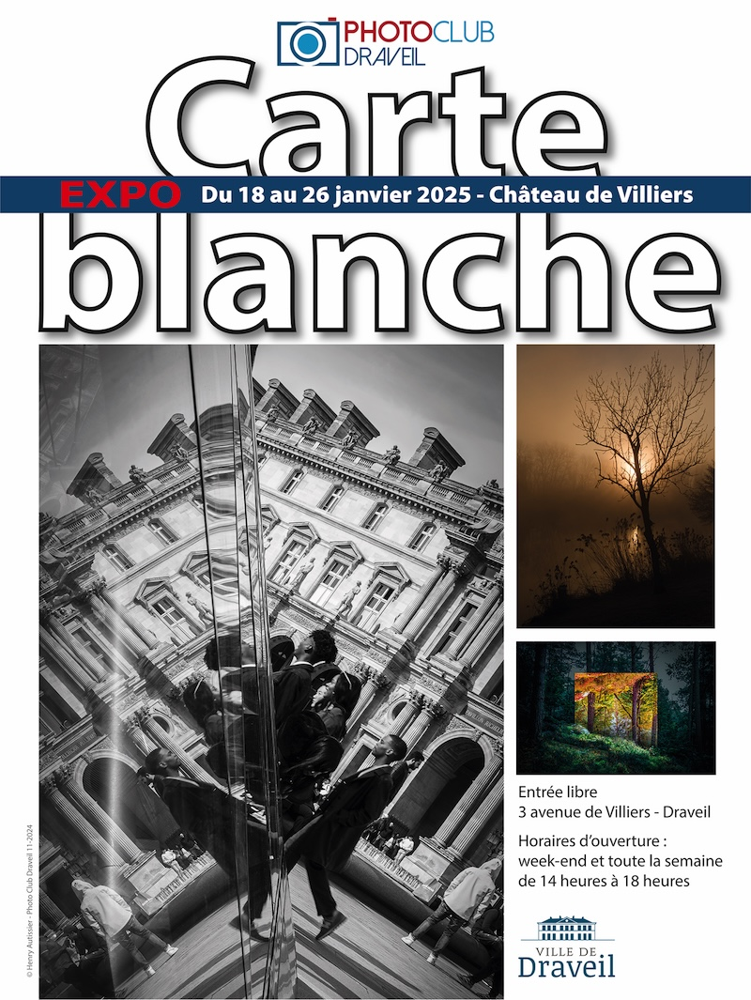

{.logo}
From January 18th to 26th, seven fellow photographers from the [Photo Club of Draveil](https://www.photo-club-draveil.fr/) and myself had the renewed opportunity to participate in an exhibition. The title was “Carte blanche” (I think this is also used in English 🤔), as each photographer could chose its own preferred theme.

Following the work started for previous exhibitions, I decided to continue exploring the world of **miniature photography**, where I want to show how our view of everyday objects can completely change when they are staged with small model railroad figures in HO scale (1/87).

Here are the 15 new photos I created and chose to exhibit this time:


