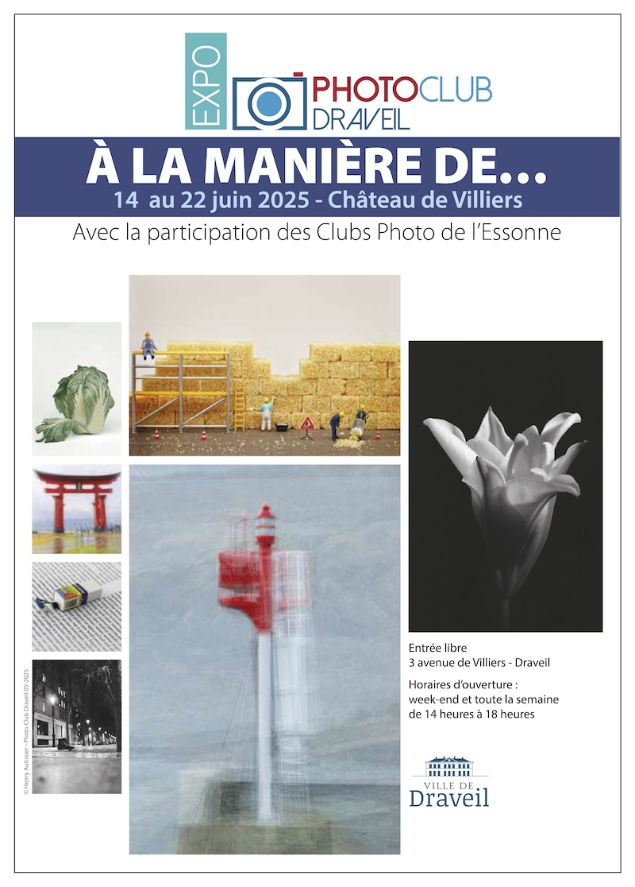

{.logo}
From June 14th to 22th, 15 fellow photographers from the [Photo Club of Draveil](https://www.photo-club-draveil.fr/) and myself had the renewed opportunity to host an exhibition.

The name of the exhibition was “À la manière de…” (which means “In the style of…”), and we collectively chose 8 artists to inspire us to create new photos for this exhibition.

Following the work started for previous exhibitions, I decided to continue exploring the world of [HO-scale miniature photography](/galleries/misc/miniature/ho-scale/), where I want to show how our view of everyday objects can completely change when they are staged with small model railroad figures in HO scale (1/87th).

You can see the 2 new photos I created for this exhibition [in the dedicated gallery](/galleries/exhibitions/2025/06-a-la-maniere-de/).
