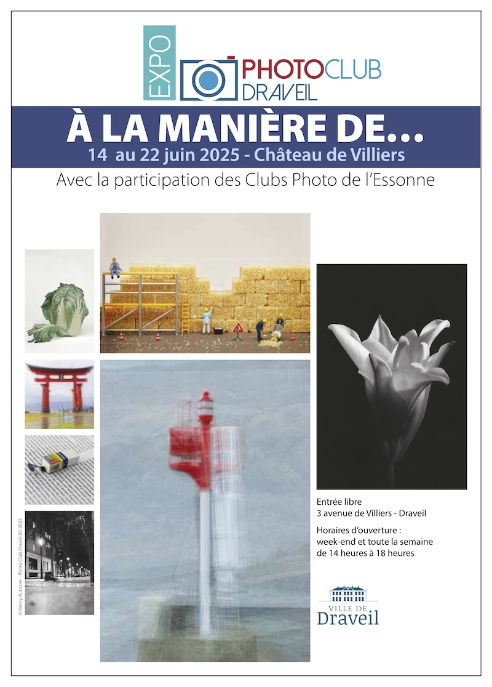

{.logo}
From June 14th to 22th, the members of the [Photo Club of Draveil](https://www.photo-club-draveil.fr/) had the renewed opportunity to host a photography exhibition.

The title was “À la manière de…” (which means “In the style of…”), and we collectively **chose 8 artists to inspire us** to create new photos for this exhibition:

- **Tatsuya Tanaka**'s [miniature photography](https://miniature-calendar.com/about/)
- [**Graffmatt**](https://www.graffmatt.com/)'s' [Urban Kaleidoscope](https://www.graffmatt.com/photographie/urban-kaleidoscope/) series
- [**Denis Brihat**](https://www.denisbrihat.com/)'s photos shot in black and white and then toned with a variety of metals and pigments to get [as close as possible to natural color](https://www.denisbrihat.com/galleries/les-oignons/)
- [**Yasuhiro Ishimoto**](https://en.wikipedia.org/wiki/Yasuhiro_Ishimoto)'s *HANA* (“Flower”) series in black and white
- [**Brassaï**](https://en.wikipedia.org/wiki/Brassa%C3%AF)'s photos of Paris' dramatic nocturnal landscape, especially his book [*Paris la nuit*](https://www.goodreads.com/book/show/7569007-paris-la-nuit)
- [**Pep Ventosa**](https://web.archive.org/web/20250609131149/https://www.pepventosa.com/)'s photography made of multiple exposure from different angles of the same subject
- [**Michel Follorou**](https://www.michel-follorou.com/)'s abstract experiments with light, matter and color
- [**Sébastien Del Grosso**](https://sebastiendelgrosso.myportfolio.com/)'s [Black Series](https://sebastiendelgrosso.myportfolio.com/the-black-series), black and white photos of urban landscapes with intense processing leading to a surreal effect

**Tatsuya Tanaka** being one of these artists, I decided to continue exploring the world of **[HO-scale miniature photography](/galleries/misc/miniature/ho-scale/)**. Here are the 2 new photos I created for this exhibition:
